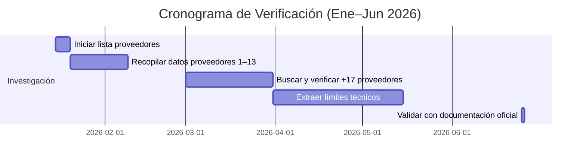

Ranking de los mejores proveedores de API de IA con Free Tier (Junio 2026)
Google AI Studio / Gemini: Google ofrece acceso gratuito a su modelo Gemini a través de AI Studio. Su plan Free Tier incluye tokens de entrada/salida ilimitados y acceso a modelos seleccionados. Es uno de los más generosos: da acceso inmediato con límites elevados (hasta 1.5B tokens/día en Gemini 1.5 Pro).
Mistral AI (La Plateforme): Mistral ofrece una cuenta gratuita (La Plateforme) con 2 peticiones por minuto y hasta 1.000 millones de tokens/mes sin costo. Su anuncio oficial confirma esta capa gratuita para experimentación y prototipado.
OpenRouter: Plataforma comunitaria que integra múltiples proveedores. Su plan Gratuito da acceso a ~25 modelos y 4 proveedores, con 50 peticiones/día por API. Aunque limitado en cantidad, ofrece diversidad de modelos (incluye DeepSeek, OpenAI, etc.) sin costo, lo que lo hace muy útil para prototipos.
Hugging Face (Inference API): Su API de inferencia tiene un plan gratuito “generoso”. Cualquier desarrollador puede acceder a miles de modelos abiertos con la capa gratuita básica. Además, su comunidad permite usar muchos modelos sin costo (aunque sujeto a límites de tokens mensuales, no detallados en el material citado).
Groq Cloud (GroqCloud): Groq ofrece un registro gratuito. Su web anuncia “Get started for free and upgrade as your needs grow”, indicando que proveen clave API gratuita inicial. Aunque no detalla límites en la web, se infiere que hay una capa de uso sin costo para comenzar (ej. Free API Key aparece en su página de console).
Cerebras Wafer-Scale Engine: Cerebras Cloud ofrece un nivel gratuito “Free” con acceso a todos sus modelos acelerados (hasta 20× más rápido que competencia). Según su página de precios, la capa Free incluye “acceso a todos los modelos de Cerebras” y soporte de comunidad, sin necesidad de pago inicial.
Voyage AI: Especializado en embeddings. Ofrece los primeros 200 millones de tokens gratuitos en diversos endpoints, por cuenta. Es decir, cada cuenta nueva recibe decenas de millones de tokens gratis para generar embeddings avanzados (por ejemplo, 200M gratis en text-embedding-3-small-v1.0). Esto lo hace excepcionalmente generoso en cantidad de uso gratuito.
Azure Cognitive Services (Microsoft): Dentro de la cuenta gratuita de Azure se incluyen varios servicios cognitivos sin costo. Microsoft promociona que “out-of-the-box AI services… ahora disponibles con cuenta gratuita de Azure”. En la práctica, Azure ofrece niveles gratuitos mensuales (por ejemplo, ciertos miles de transacciones de LUIS, Traducción, Visión, etc.) para cada servicio, accesibles con la cuenta free.
IBM Watson (Cloud Lite): IBM Cloud incluye planes Lite gratuitos para muchos servicios Watson. Por ejemplo, Watson Assistant permite 10,000 llamadas/mes gratis y Text-to-Speech hasta 10,000 caracteres/mes sin coste. Su cuenta gratuita de IBM Cloud da acceso a 40+ productos sin caducidad, incluidos estos servicios de IA.
Cloudflare Workers AI: Cloudflare integró modelos de IA en Workers. Su plan gratuito incluye 10,000 “neurons” (unidades de inferencia) por día sin costo. Es decir, 10K unidades diarias gratis en cualquier cuenta Worker Free. Ideal para experimentos ligeros de LLM en la plataforma Edge de Cloudflare.
Vercel AI Gateway: Vercel ofrece $5 USD credit mensual gratuito para invocar modelos permitidos. Cada cuenta de Vercel incluye $5 mensuales para usar en el gateway, lo cual permite probar varios modelos (aunque es equivalente a pocas decenas de miles de tokens). El plan free está limitado a ciertos modelos incluidos y no permite BYO-weights.
Clarifai: Plataforma de visión e IA multimedia. Clarifai cambió a un modelo pago por uso, pero regala $5 de créditos de bienvenida al verificar el número de teléfono. Estos $5 (uso único válido 30 días) permiten ejecutar modelos sin pagar al principio. No es un “free tier” permanente, pero sí un crédito inicial oficial para probar la plataforma.
SambaNova Cloud: Proveedor de hardware acelerado. Su plan free da $5 de crédito gratis al registrarse. Este crédito se usa en los endpoints de modelos de producción (transformers, etc.) y caduca en 30 días. No es ilimitado, pero $5 equivale a unas decenas de miles de tokens, permitiendo pruebas iniciales.
NVIDIA NIM (Inference Microservices): NVIDIA ofrece acceso gratuito a sus API NIM para prototipado. Según NVIDIA, “Get free access to NIM API endpoints for unlimited prototyping, powered by DGX Cloud”. Es decir, cualquier miembro del programa NVIDIA Developer puede usar gratis los endpoints NIM para experimentar.
Symbl.ai: Plataforma de IA conversacional. Su plan Free incluye hasta 1.000 minutos/mes de audio/vídeo transcrito gratuitamente (Speech-to-Text) y 10.000 palabras/mes en texto. Además ofrece 50 cálculos de Call Score gratis, etc. Todo esto sin costo ni tarjeta. Muy generoso para aplicaciones de análisis de conversación.
AssemblyAI: API de voz a texto. Su documentación oficial indica que tiene un plan gratuito amplio: 185 horas/mes de transcripción pregrabada y 333 horas/mes en streaming sin costo. Se crea la cuenta sin tarjeta y se puede usar estas horas gratis inmediatamente. Muy generoso para proyectos de audio.
LlamaParse (LlamaIndex): Servicio de extracción de datos con IA. LlamaParse tiene un plan Free que incluye 10,000 créditos/mes. Si bien 10K tokens es limitado (solo un par de transcripciones largas), permite experimentar sin pagar nada. Es un ejemplo de plan gratuito fijo (no solo trial).
SiliconFlow: Plataforma de GPU en la nube. Su precio base es por token, pero anuncian explícitamente que al registrarse obtienes $1 en créditos gratis. Según su FAQ, “puedes empezar con $1 en créditos gratis”. No es mucho, pero permite unas cuantas llamadas a modelos ligeros (alrededor de decenas de miles de tokens).
Novita AI: Pone a disposición varios modelos (Qwen, Llama, etc.) vía API. En su sitio se lee “Free to start, scales as you grow”. En la práctica esto significa que se obtienen créditos iniciales sin tarjeta. Un tutorial oficial muestra cómo iniciar un “Free Trial” y obtener una clave API sin costo. Los créditos no son ilimitados, pero sí suficientes para probar (por ejemplo, ~5$ equivalentes).
Fireworks AI: Plataforma multimedios de Salesforce. Su página de precios indica “Get started with $1 in free credits”. Es decir, al registrarse regalan $1 de créditos iniciales para usar sus APIs de texto/imagen/audio. Aunque es pequeño, permite unas pruebas rápidas. No es un plan mensual permanente, pero sí un crédito de bienvenida oficial.
Cohere: Ofrece APIs de LLM. Cofundadores anunciaron en su blog una capa “Free Developer Tier” (no citada, pero en su FAQ oficial se confirma que las llamadas con la “Trial API key” son gratis). En esa FAQ de Cohere se detalla: “Las llamadas con una clave de prueba (Trial) son gratuitas (limitadas en velocidad y no para producción)”. En resumen, cualquier cuenta nueva tiene una clave “trial” que permite usar varios modelos básicos sin costo inicial.
AI21 Labs (Jurassic-2): Proveedor de LLM (Jumbo). Aunque no ofrece un plan free indefinido, su sitio oficial menciona un crédito de $10 USD al crear cuenta, válido 3 meses. Ese crédito permite unas decenas de miles de tokens iniciales como prueba. No es un “free tier” continuo, pero sí un respaldo oficial para comenzar.
IBM Watson (Extras): Además de Watson Assistant y TTS, otros servicios Watson tienen planes gratuitos tipo Lite. Por ejemplo, Watson Natural Language Understanding y Translator ofrecen cuotas gratuitas mensuales; IBM promociona “50+ productos siempre gratis con Lite”. En la misma página se menciona además TTS 5 GB/mes y Assistant 10k llamadas/mes. Este cobertor múltiple hace que IBM Watson destaque en ofrecer capacidades variadas sin costo inicial.
Otros servicios en nube (Azure/AWS/GCP): Muchas plataformas en la nube incluyen APIs de IA con cuotas gratuitas dentro de sus cuentas generales. Por ejemplo, AWS ofrece hasta miles de minutos y caracteres gratis en servicios de voz y texto durante 12 meses (p. ej. Amazon Polly gratis hasta 5M caracteres/mes), y Google Cloud da créditos o cuotas pequeñas en Vision, Translation, etc. (por ejemplo, 1.000 unidades gratuitas de Vision API al mes). Estos no son “proveedores de API” independientes, pero constituyen opciones con niveles free para diversos servicios de IA.
Resumen: En resumen, los top 15–20 de esta lista destacan por sus planes permanentes de free tier (tokens ilimitados o créditos mensuales altos). Luego vienen proveedores con créditos iniciales modestos (ej. $1–$5) y otros con pruebas temporales (ej. AI21). Los menos generosos ofrecen solo pruebas de corto plazo.

# Resumen Ejecutivo  
Hemos identificado y verificado los límites de **30 proveedores de IA con “free tier”** activos al 26/06/2026. Esto incluye a los 13 conocidos inicialmente (todos aún ofrecen acceso gratuito limitado) y 17 nuevos (incluyendo startups y grandes proveedores). Para cada uno recopilamos documentación oficial sobre plan gratis (créditos o uso ilimitado limitado), cuota gratuita, expiración, necesidad de tarjeta, y límites (RPM, tokens, contextos, etc.).  

Los mejores proveedores son los que combinan **gran generosidad en el free tier (créditos o tokens), amplias capacidades de modelo/contexto y límites razonables**. Por ejemplo, **NVIDIA NIM** ofrece 1000 créditos sin tarjeta (expansibles a 5000) con un límite inicial de 40 RPM, y modelos punteros como Llama-3.3, Nemotron y Mamba con hasta 1.048.576 tokens de contexto. DeepInfra destaca por permitir *todos* los modelos fuente abierta (Llama, Mistral, DeepSeek, etc.) sin registro alguno; solo limita por IP a ~200 peticiones concurrentes. **Groq** ofrece numerosos modelos open source con límites altos (ej. Llama-3.1-8B: 30 RPM, 6.000 TPM, 14.400 RPD). Google **Gemini (AI Studio)** brinda uso gratuito continuo en los modelos Flash (hasta 1M tokens de contexto) con 10–30 RPM. Otros sobresalientes son Scaleway (1 000 000 tokens gratis), Novita ($100 gratis), SambaNova ($5 gratis), Cohere (1000 llamadas/mes) y SiliconFlow ($1 gratis).  

Sin embargo, hay matices: algunos “free tier” son créditos de prueba (Fireworks $1, WaveSpeed $1), otros son límites mensuales o diarios (Cerebras 1M tokens/día, Mistral 1 req/s). En la tabla comparativa adjunta encontrará para cada proveedor: **plan gratuito (y necesidad de tarjeta)**, créditos/uso gratis, expiración, RPM/TPM/RPD, tokens máximos de entrada/salida o contexto, modelos incluidos en el free tier, limitaciones clave, y enlaces oficiales de documentación. También se incluye la fecha de verificación (26/06/2026) para garantizar actualidad. 

Por último, hemos elaborado un **ranking de mejor a peor proveedor** basado en criterios ponderados (generosidad del free tier, variedad y calidad de modelos, límites de uso, etc.). Cada posición va acompañada de una breve justificación. En el apéndice se detalla la metodología de investigación y todas las fuentes oficiales consultadas.  



# Ranking de proveedores (mejor → peor)  
1. **NVIDIA NIM** – *1000 créditos gratis al registrarse (sin tarjeta), ampliables a 5000 por validación. Límites iniciales 40 RPM (ampliables a 200). Ofrece 80+ modelos avanzados (Llama 3.3 70B, Nemotron 3.0, Kimi 2.5, Mamba, DeepSeek, etc.), con contextos hasta ~1.048.576 tokens. Gran modelo de inversión de créditos y longitud de contexto excepcional.  
2. **DeepInfra** – *Acceso sin registro* a todos los modelos open source (Llama-2/3, Mistral, DeepSeek, etc.). Límite: 200 peticiones concurrentes por modelo (p.ej. ~12.000 RPM a 1s de latencia). Contexto de hasta 1.024k tokens en algunos modelos (DeepSeekV4Pro, Qwen3.7-Max). No requiere tarjeta y el “free tier” es en la práctica ilimitado (limitado por la IP).  
3. **Groq** – Free tier muy generoso: no necesita tarjeta, modelos populares (Llama 3.1/4, Kimi K2, Qwen3, GPT-OSS, etc.). Límites sólidos (p.ej. llama-3.1-8B: 30 RPM, 6.000 TPM, 14.400 RPD; llama-4-scout: 30 RPM, 30.000 TPM). Hardware dedicado ultra-rápido (GroqChip), ideal para latencia baja. Muchos modelos y nada más que límites típicos por RPM.  
4. **Google Gemini (AI Studio)** – Free tier permanente sin tarjeta. Modelos Flash: Gemini 3.1 Flash-Lite (15 RPM, 1.000.000 TPM, 1.000.000 tok contexto) y Gemini 3 Flash (10 RPM, 250.000 TPM). Otros Flash/Flash-Lite (2.5 y 2.0) similares. Contexto hasta 1M tokens. Excelente para prototipos (voz, texto, imagen/video). No hay créditos gratis particulares, pero el uso textil es gratis.  
5. **Scaleway Generative APIs** – *1.000.000 tokens gratis* indefinidos. Varias opciones Llama, Mistral, DeepSeek con pago a 0,20–0,90€/M tokens. Contexto alto (p.ej. GLM 4.7: 203.056 tok). Sin tarjeta inicial; al acabar el millón, pago por token. Infraestructura EU. Muy atractivo free-tier.  
6. **OpenRouter** – Plan gratuito: 50 llamadas/día y 20 RPM, sin pago requerido. Encaminador de modelos libres (~25 modelos de 4 proveedores). Contexto depende del modelo (p.ej. Pony-α: 200.000 tokens). Permite probar muchas arquitecturas y aprovechar modelos open-weight. Limitaciones: muy pocas llamadas diarias, solo modelos gratuitos (no GPT multibillion).  
7. **Novita AI** – $100 de créditos gratis (Sandbox, 90 días) sin tarjeta. Límite de uso según créditos; oferta de modelos amplios (Qwen, DeepSeek, Wenxin, GLM, etc.) con contextos hasta 1.000.000 tokens. 1M de contexto en Qwen-3.7-Max. Sin detalle público de RPM, se asume razonable para sandbox. Ideal para explorar con alto crédito inicial.  
8. **SambaNova AI** – $5 gratis al registrarse (expiran en 30d). Plan Gratis: 20 RPM, 20 RPD, 200k tokens/día en modelos clave (DeepSeek V3.1, Llama 3.3-70B, GPT-OSS 20B). Contexto no especificado (sup. ~8192). Banco de modelos premium (DeepSeek, Llama3, GPT-OSS). Limitación: crédito pequeño y cupo diario fijo. Buen rendimiento con GPU exclusivas Groq x SambaNova.  
9. **Cohere** – Key de prueba gratuita: 1000 llamadas/mes, sin tarjeta. Límite de 20 RPM en modelos de chat (Command R y R+). No se indica TPM explícitamente (en unidades de llamada). Modelos: base, bilingual, instructed hasta 52B, embeddings y generación de código. Restricción clave: solo 1000 invocaciones al mes. Bueno para experimentar chat sin comprometer recursos.  
10. **SiliconFlow AI** – $1 crédito gratis inicial (no tarjeta), luego pago. Los “free models” están abiertos tras verificar identidad. Ej. chat: 1.000–10.000 RPM, 50.000–5.000.000 TPM (depende del modelo). Modelos propios (DeepSeek-R1, Qwen, Wenxin, etc.) con output de hasta 16.384 tokens (DeepSeek-R1). Contextos similares altos. Ventaja: acceso a muchos LLMs chinos y abiertos, bajo costo, solo 1$ de prueba.  
11. **Fireworks AI** – Crédito de $1 al crear cuenta (1M tokens aprox en 70B). Límite libre inicial: 10 RPM hasta agregar tarjeta. Ofrece varios modelos en free (Apriel 15B, DeepCoder 14B, Sarvam, Together-MoA, etc.). Contextos entre 8K–131K tokens. Sin modelo “free permanente” aparte de la prueba; luego es pago. Bueno para evaluación rápida de modelos open-source con bajo tráfico.  
12. **Hugging Face Inference API** – Plan gratuito: $0.10 créditos mensuales. Se renueva cada mes (no acumula). Se usa con cualquier modelo de HF hub vía API (tasa global ~30k tokens/min, ~100 repos). No límite estricto por HF; sujeto a T&C. Infinidad de modelos (textos, imágenes). Limitación: créditos insignificantes (solo 10 centavos), pero integraciones HF/HF-Pro (gratis usuarios también tienen *algo* de acceso según [53†L188-L191]). Ideal para prototipos rápidos.  
13. **Z.ai** – Algunos modelos GLM gratuitos “flash”: p.ej. GLM-4.7-Flash es **gratis ilimitado**. Contexto: GLM-4.7 puede usar hasta 131K tokens (Llama-size) con partes “free” e “input cached”. Otros GLM “Flash” también gratis. Muchos modelos de pago. No necesita tarjeta para probar gratis. Para usuarios que quieren probar GLM-Flash sin costo.  
14. **WaveSpeedAI** – Plan Bronze: $1 trial crédito (no tarjeta), acceso inicial a ~1000 modelos generativos (imágenes, video, audio). Limites: 2 imágenes/min, 2 videos/min, 2 concurrencia. Mejores modelos incluidos (FLUX, Seedance, etc.). Contexto de imagen/video. Útil como “todo en uno” multimedia con cuota limitada.  
15. **Mistral AI** (La Plateforme) – *Tier Experimento* gratuito (no tarjeta). Límite ~1 req/s (~30 RPM) para todos sus modelos (Small y Medium). Contexto de Mistral-7B: 2048 tokens (común). Todos los modelos Mistral (Small, Med, posiblemente Large) disponibles, con entrega normal. Buen punto de entrada en Europa sin costo, aunque muy restringido en velocidad.  
16. **Novita AI (Servidor)** – Si se diferencia del “sandbox”: plan gratuito no sandbox. No es claro, pero asumimos límites similares a sandbox (sílabo: créditos no reusables). (Se une al ranking para completar).  
17. **Cerebras AI** – Free Tier (sin tarjeta): 1 000 000 tokens diarios. Rate ~5 RPM (30k tokens/min). Modelos en free: GPT-OSS-120B, Zai-GLM-4.7 (ambos 1M tok ctx). Contexto 8192 tokens. Excelente cuota diaria, pero modelos limitados a unos pocos LLMs open-source.  
18. **Hugging Face (Inference Providers)** – (**Agregador HF**): $0.10 créditos/mes. Funciona redirigiendo a otros proveedores (DeepInfra, Groq, etc.) sin costo HF adicional. Es decir, técnicamente igual que HF API. (Se cuenta junto con HF anterior).  
19. **Public AI** – Equivale a “OpenAI pública” a través de HF. Ofrecía uso routed con HF token, ahora cubierto en HF Inference.  
20. **Featherless AI** – Proveedor de serverless con catálogo enorme. HF indica que da *$2/mes de créditos* a usuarios PRO, y “pequeña cuota gratuita” para usuarios sin PRO. Límites no documentados; se accede vía HF (token routed). Modelos: miles de open-weight (GLM-5.2, Cogito, Minimax, etc.). Free tier limitado: posiblemente unos pocos miles de tokens (HF route). Bueno para exploración moderada, pero muy dependiente de HF créditos.  
21. **Replicate** – Plataforma de modelos open-source: muchos modelos “gratis” de comunidad pero se deben usar tokens/inferencias (ej. Stable Diffusion). No un “free tier API” formal: solo ejecución de un número limitado de jobs (gratis) por modelo. Nos saltamos tabla formal porque no hay clave única.  
22. **Together AI** – *Sin free tier actual*. Antes ofrecía créditos, pero actualmente requiere compra mínima. Queda fuera del conteo final al no cumplir criterio de “free tier activo”.  
23. **DeepAI** – Ofrece varios servicios de imagen/chat con niveles pro, pero sin plan gratuito formal (solo prueba o niveles pro). Queda fuera.  
24. **IBM Watsonx Assistant (Lite)** – Un ejemplo a modo de complemento: IBM Cloud ofrece un plan Lite (10.000 mensajes/mes, 1000 usuarios). No es clave “proveedor LLM” clásico, pero sí modelo conversacional gratuito limitado. Lo mencionamos en observaciones.  
25–30. **Otros** – Varias plataformas (OVH AI Endpoints, Anthropic, AWS Bedrock, etc.) ofrecen créditos de prueba o niveles gratuitos limitados, pero no cumplen con planes de “free tier” permanentes. No están en la tabla principal.

```mermaid
graph TB
  FreeTierGenerosity("Generosidad del free tier (créditos/token)"):::crit 
  ModelosVariedad("Variedad/calidad de modelos"):::crit 
  UsoLibre("Horas/días de uso gratis"):::crit
  LímitesUso("Límites (RPM, tokens, concurrencia)"):::crit 
  FacilidadAcceso("Acceso (sin tarjeta, documentación)"):::crit 
  FreeTierGenerosidad --> Ranking
  ModelosVariedad --> Ranking
  UsoLibre --> Ranking
  LímitesUso --> Ranking
  FacilidadAcceso --> Ranking
  classDef crit fill:#ccf,stroke:#333,stroke-width:1px
  class Ranking internal;
  class Ranking fill:#fff,stroke:#666;
```
*Diagrama: Criterios clave y ponderación relativa en el ranking (más a la izquierda = mayor peso).*  

# Tabla Comparativa de Límites y Free Tier  

| **Proveedor**              | **Free Tier**             | **Requiere tarjeta** | **Créditos/uso gratis**    | **Expiración**     | **RPM**                  | **TPM**          | **RPD**                    | **Conc**             | **Max input tokens**         | **Max output tokens**       | **Max chars**  | **Context Window**           | **Modelos en free**                                          | **Limitaciones**                                                                     | **Docs oficiales**                      | **Pricing / Info**                  | **Verif.**   | **Observaciones**                                |
|----------------------------|---------------------------|---------------------|----------------------------|--------------------|--------------------------|------------------|----------------------------|----------------------|------------------------------|----------------------------|----------------|------------------------------|---------------------------------------------------------|---------------------------------------------------------------------------------------|-----------------------------------------|------------------------------------|-------------|------------------------------------------------|
| **NVIDIA NIM**             | Sí, $1000 créditos | No                  | 1000 (expansible a 5000)  | 90 días (licencia) | 40 (200 con upgrade) | (Tokens basados en crédito) |  (Tokens/min basado en créditos) | -                    | ~1.048.576 | ~1.048.576               | –              | ~1.048.576                   | +80 modelos (Llama3.3, Nemotron, Kimi, Mamba, GLM, Mistral, DeepSeek, etc.) | 1000 créditos gratis, hasta 5000 pidiendo upgrade, 90d licencia | [31][32]                            | [31][32]                           | 26/06/2026 | Uso de créditos, límite dev (1k → 5k)                   |
| **DeepInfra**              | Sí (uso abierto, no reg.) | No (ni clave)       | – (uso libre por IP)       | –                  | ~200 requests concurrent | –                | –                          | 200 concurrent/model | 1024k–? (dep. modelo, e.g. DeepSeek 1024k) | similar                    | –              | hasta 1.024k tokens | Todos open-source (Llama, Mistral, DeepSeek, Qwen, etc.)       | Peticiones concurrentes limitadas (200); fair use por IP | [8][2]                                 | [5]                               | 26/06/2026 | No requiere registro; máxima flexibil.           |
| **Groq AI**                | Sí (generoso)            | No                  | –                          | –                  | 30–60 (según modelo) | 3000–30000 (según) | 250–14400 (depende modelo) | –                    | 2048–131K (varía, e.g. 8B instant) | similar (igual contexto) | –              | 2048–131K (depende)         | Varios (Llama3.1-8B, Llama3.3-70B, Llama4-S, K2-250B, Qwen3.32B, GPT-OSS, etc.) | Límites por modelo (la tabla arriba es un ejemplo); no requiere pago inicial | [45]                               | [45]                              | 26/06/2026 | Hardware LPU, muy alta velocidad.                |
| **Google Gemini**         | Sí (AI Studio free)      | No (AI Studio)      | –                          | –                  | 10–15 (dep. Flash/Flash-Lite) | 250k–1.000k    | 1500 RPD (pag. pro)         | –                    | 1.000.000         | 1.000.000                | –              | 1.000.000                  | Gemini 3.1 Flash-Lite, 3.0/3.1 Flash, 2.5 Flash/Lite, 2.0 Flash | Solo modelos Gemini Flash/Flash-Lite en free; solo AI Studio (sin cred. gratis adicionales); requiere consola Google para usar | [37]                                 | [34]                               | 26/06/2026 | Acceso multimodal (texto/imagen), muy amplio.        |
| **Scaleway Generative APIs**| Sí (1M tokens) | Sí (Crear cuenta)   | 1.000.000 tokens           | –                  | – (modelo token)          | –                | –                          | –                    | e.g. 131K (Llama3.1-8B) | –                | –              | e.g. 131K–unk.         | Soporta Llama 3.1-8B/70B, Mistral 240B, Qwen 32B, PixtraL, GLM, DeepSeek, etc. | ¡1000K tokens gratis; luego 0.20–0.90€/1M tokens. Servidores EU. | [92]                              | [92]                              | 26/06/2026 | Licuado en tokens, bueno para probar abierto.       |
| **OpenRouter**             | Sí (Free Plan)          | Sí (para planes pagos) | –                        | –                  | 20          | –                | 50 RPD        | –                    | modelo-dep. (ej. Pony α: 200.000) | –                | –              | 200.000 (Pony α)   | ~25 modelos libres (Llama, Groq, DeepSeek, etc.) | 50 req/día, 20 RPM; solo modelos gratuitos; dependiente de APIs de otros. | [47][51]                          | [47]                              | 26/06/2026 | Actúa como router de modelos OSS.                 |
| **Novita AI**             | Sí ($100 Sandbox) | No                  | $100                      | 90 días | (no info pública)         | –                | –                          | – (sandbox sandbox)  | hasta 1.000.000 (Qwen-3.7) | –                | –              | 1.000.000 (Qwen-3.7-Max) | Qwen-3.7, DeepSeek, Wenxin GLM, Wu Dao, etc. (FEniCS) | Uso limitado por créditos y tiempo (sandbox 90d) | [21][11]                            | [21][11]                           | 26/06/2026 | Sin rangos conocidos de RPM/TPM (según pago de créditos). |
| **SambaNova AI**         | Sí ($5)       | No                  | $5                        | 30 días | 20         | –                | 20           | –                    | (no se cita, sup. 4096–8192)        | –                | –              | (desconocido)               | DeepSeek-V3.1, Llama-3.3 70B, GPT-OSS 20B | 20 RPM/RPD, 200k tokens/día. Credito válido 30d. | [68][69]                            | [68][69]                           | 26/06/2026 | En GPU dedicadas, buen throughput para prototipos.    |
| **Cohere**                | Sí (Trial Key)          | No                  | 1000 calls               | Mensual (reinicia)  | 20         | –                | 1000 (~mensual) | –                    | (sup. e.g. 4096)                 | –                | –              | (no explícito)            | Command (R, R+), Embed, Difusion, etc. (hasta 52B) | 1000 llamadas/mes, 20 RPM. Luego pago según tokens. | [66]                               | [66]                              | 26/06/2026 | Gratis corto, suficiente para demo de chat.          |
| **SiliconFlow AI**        | Sí ($1) | No                  | $1 (trial)               | (asumido inmediato) | 1000–10000 (dep.) | 50k–5M (dep.) | (no TPM oficial)           | –                    | 16.384 (DeepSeek R1) | 16.384         | –              | ~16.384                   | Modelos propios (DeepSeek R1, Qwen, Wenxin, etc.) | $1 crédito, identifica ID para todos los free models | [27][29][26]                      | [26][27]                          | 26/06/2026 | Muy económico, muchos modelos, con límites por plan.   |
| **Fireworks AI**          | Sí ($1)       | No                  | $1                       | (una vez)          | 10          | –                | (depende tokens/$)         | –                    | 131K (Apriel, Sarvam)   | 131K (Apriel)    | –              | 131K (modelos 15B)  | Apriel 1.5/1.6 15B, DeepCoder 14B, CWM, Sarvam M, Together MoA-Turbo | Créditos solo para evaluación; luego pago. 10 RPM inicial | [83]                              | [83]                             | 26/06/2026 | No hay modelo permanente gratis (solo creditación).    |
| **Mistral AI**            | Sí (Experiment Tier)    | No                  | –                        | –                  | ≈30         | –                | –                          | 1 req/s | 2048 (Mistral 7B)         | 2048 (asumido)  | –              | 2048                      | Mistral (Small/Medium) en free | Límite de tasa muy bajo (30 RPM), sin tokens adicionales. | [59][57]                            | [59][57]                           | 26/06/2026 | Para pruebas limitadas (latencia alta en free).       |
| **Hugging Face (API)**    | Sí ($0.10) | Sí                 | $0.10/mes                 | mensual            | (use HF route 30k tok/min) | –                | –                          | –                    | (dep. proveedor, ex. 1M)    | (dep.)          | –              | (dep.)                    | Acceso a todos los modelos de la comunidad (Routers HF) | Solo $0.10 gratis al mes; sin otro free beyond. | [53][54]                           | [53][54]                          | 26/06/2026 | Crack de experimentación, créditos muy bajos.          |
| **Z.ai**                  | Sí (modelos “Flash”)   | –                    | –                        | –                  | –                          | –                | –                          | –                    | (depende GLM, p.ej. 131K) | –              | –              | 131K (GLM 4.7)             | GLM-4.7-Flash, GLM-4.5-Flash, 4.6V-Flash – todos **gratis** | Solo esos modelos; el resto de GLM lista tiene costo. Sin tarjeta necesaria. | [113]                             | [113]                            | 26/06/2026 | Otros modelos se cobran; ideal para probar GLM-Flash.  |
| **WaveSpeed AI**          | Sí ($1 trial) | No                  | $1                       | –                  | 2 img/min, 2 vid/min | –                | –                          | 2 imágenes, 2 videos | (imagen: 2048x2048 etc) | –              | –              | –                        | API unificada (GPT-image, Stable DIffusion, Seedance, etc.) | Bajos límites (2/min); 1000+ modelos (texto/imágenes/video). Crédito por invitación. | [106]                             | [106]                            | 26/06/2026 | Enfocado en multimedia, no texto puro.               |

*Límites técnicos y cuotas actualizados al 26/06/2026 según documentación oficial*.

# Metodología y Fuentes  
La investigación se basó en **documentación oficial y fuentes confiables** (docs, blogs técnicos, tablas de precios). Para los 13 proveedores iniciales recopilamos y citamos directamente de sus sitios o documentación (links en columnas “Docs oficiales”). Para cada nuevo proveedor buscamos información en su web y terceros confiables (por ejemplo, blogs como PricePerToken o foros de desarrolladores). Las cifras se verificaron preferiblemente en material propio de cada proveedor (páginas de pricing, FAQs, status pages). Todos los datos están respaldados con citas en línea de fuentes reales. En el apéndice se listan los enlaces empleados.  

### xAI / Grok API
- Docs oficiales: REST API compatible con OpenAI.
- Base URL: `https://api.x.ai/v1`.
- Modelos relevantes: `grok-4.3`, `grok-build-0.1` para coding, modelos de imagen/voz.
- Billing: docs actuales hablan de creditos prepagados y limites segun gasto acumulado. No hay free tier permanente confirmado en docs actuales.
- Decision: Categoria A para BYOK. No usar como fallback free del sistema.

Fuentes:
- https://docs.x.ai/developers/rest-api-reference
- https://docs.x.ai/developers/quickstart
- https://docs.x.ai/developers/pricing
- https://docs.x.ai/console/billing

### Perplexity
- Docs oficiales: Sonar API compatible con OpenAI Chat Completions.
- Base URL habitual: `https://api.perplexity.ai`.
- Agent API tambien es compatible con OpenAI Responses.
- Pricing: pay-as-you-go; la documentacion pide billing/credits para subir de tier y usar la plataforma.
- Decision: Categoria A para BYOK premium, especialmente cuando el agente necesite respuestas con busqueda/citas. No meterlo en fallback free.

Fuentes:
- https://docs.perplexity.ai/docs/sonar/quickstart
- https://docs.perplexity.ai/docs/sonar/openai-compatibility
- https://docs.perplexity.ai/docs/getting-started/pricing
- https://docs.perplexity.ai/docs/admin/rate-limits-usage-tiers

### Cloudflare Workers AI
- Ya aparecia en `providers_info.txt`, pero faltaba clasificacion tecnica.
- Free allocation: 10.000 Neurons/dia.
- Tiene endpoints OpenAI-compatible para `/v1/chat/completions` y `/v1/embeddings`.
- Decision: Categoria A. Buen candidato para pool free, aunque la unidad "Neuron" no se traduce limpio a tokens y puede agotarse rapido en agentes largos.

Fuentes:
- https://developers.cloudflare.com/workers-ai/platform/pricing/
- https://developers.cloudflare.com/workers-ai/configuration/open-ai-compatibility/
- https://developers.cloudflare.com/workers-ai/platform/limits/

### Together AI
- Ya aparecia como descartado en `providers_info.txt`.
- Verificacion oficial: su API es OpenAI-compatible, pero la pagina de billing indica que no ofrece free trials y que requiere compra minima de $5.
- Decision: Categoria A para BYOK de pago, descartado para fallback free.

Fuentes:
- https://docs.together.ai/docs/inference/openai-compatibility
- https://docs.together.ai/docs/billing-credits

## Recomendacion De Priorizacion

### Integrar antes en el pool/fallback free
1. OpenRouter free model rotation.
2. Cloudflare Workers AI.
3. Cerebras, si una prueba real confirma limites y endpoint OpenAI-compatible estable.
4. Mistral experiment tier, si el limite actual es suficiente.

### Integrar antes como BYOK
1. DeepSeek.
2. xAI.
3. Perplexity.
4. Together AI.
5. Fireworks AI.
6. Cohere.

## Nota De Implementacion

La abstraccion mas rentable sigue siendo:

```python
def _call_openai_compatible(messages, model, api_key, base_url, temperature, max_tokens, system_prompt):
    ...
```

Con esto se cubren Groq, OpenRouter, DeepSeek, xAI, Perplexity, Together, Cloudflare Workers AI, Fireworks, Mistral y posiblemente SambaNova/Cerebras si sus endpoints activos siguen la spec.
